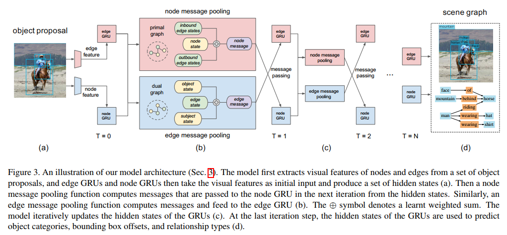
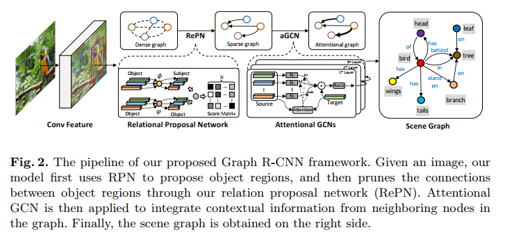

##  Scene Graph Generation by Iterative Message Passing(CVPR 2017)
> 1. 采用的方法：
>    + 用RNN解决了场景图推理问题
>    + 使用一种新的推理公式，通过沿场景图的拓扑结构（二部图关系）传递上下文消息来迭代地优化其预测。
>    + 在Faster-RNN提取object/Relationship feature的基础上，用Message Passing迭代，通过相邻的节点或边对目标节点或边进行约束，从而对这些特征进行提升
> 2. 数据集
>    + Visual Genome —— 进行场景图生成
>    + NYU Depth v2 —— 推断支持关系
> 3. 评价指标
>    + Predicate Classification (PredCls)
>    + Scene graph Classification (SGCLS)
>    + Scene graph Generation (SGGEN)
>    + Recall@K
>     即预测出的最有可能的K个三元组关系中真实的三元组所占的比例
> 4. 模型框架
>   
> 5. 开源地址
>   https://github.com/danfeiX/scene-graph-TF-release

##  Graph R-CNN for Scene Graph Generation(ECCV 2018)
> 1. 采用的方法：
>    + Graph R-CNN
>       + a Relation Proposal Network (RePN) —— 关系过滤
>       + an attentional Graph Convolutional Network (aGCN) —— 信息融合
> 2. 评估指标
>    + Predicate Classification (PredCls)
>    + Phrase Classification (PhrCls) 
>    + Scene Graph Generation (SGGen) 
>    + SGGen+（他们新提出的）
>       【但看别人评价说这个指标似乎比较粗糙，而且举的例子有误导的嫌疑。不过如果核心object的分类有明显的错误，比如直接从human错分为bicycle，那么确实应该把所有他的relation都看成错的】
> 3. 数据集
>    + Visual Genome
> 4. 模型框架
>   
> 5. 开源地址
>   https://github.com/jwyang/graph-rcnn.pytorch
> 6. 总结
>   本质还是message passing，这篇文章加入了个小trick，把前人的稠密图message passing变成稀疏图的message passing。

##  Scene Graph Generation from Objects, Phrases and Region Captions (ICCV 2017)
> 1. 采用的方法：
>    + 对Object detection, scene graph generation and region captioning,三个任务进行联合训练，来提供额外信息
>    + Multi-level Scene Description Network (MSDN)
> 2. 评估指标
>    + Predicate Classification (PredCls)
>    + Phrase Classification (PhrCls) 
>    + Scene Graph Generation (SGGen) 
>    + Recall@K
> 3. 数据集
>    + Visual Genome
> 4. 模型框架
>   
> 5. 开源地址
>   https://github.com/yikang-li/MSDN

##  Factorizable Net: An Efficient Subgraph-based Framework for Scene Graph Generation(ECCV 2018)
> 1. 采用的方法：
>    + 对Object detection, scene graph generation and region captioning,三个任务进行联合训练，来提供额外信息
>    + Multi-level Scene Description Network (MSDN)
> 2. 评估指标
>    + Phrase Detection (PhrDet)
>    + Scene Graph Generation (SGGen) 
>    + Recall@K
> 3. 数据集
>    + Visual Relationship Detection
>    + Visual Genome
> 4. 模型框架
>   
>   
> 5. 开源地址
>   https://github.com/yikang-li/FactorizableNet
> 6. 总结
>   和上面提到的Graph R-CNN的核心想法很像，都是发现了原先的message Passing是用的稠密图，Graph R-CNN是通过将其改成稀疏的这个小trick来操作的，而这篇文章把一些节点整合成子图再看成一个节点。

##  Scene Graph Generation with External Knowledge and Image Reconstruction(CVPR 2019)
> 1. 采用的方法：
>    + 特征优化模块
>       从 ConceptNet 中提取有用的信息，从而在场景图生成之前细化object和phrase特征。再利用动态内存网络(DMN)对检索到的事实进行多步推理，并据此来预测最有可能的relations
>    + 图像级监督模块
>       用来规范化场景图生成模型，将此辅助分支视为正则化器 (仅在训练期间存在)
> 2. 评估指标
>    + Phrase Detection (PhrDet)
>    + Scene Graph Generation (SGGen) 
>    + Recall@K
> 3. 数据集
>    + Visual Relationship Detection
>    + Visual Genome
> 4. 模型框架
>   
> 5. 开源地址
>   https://github.com/arxrean/SGG_Ex_RC

##  Knowledge-Embedded Routing Network for Scene Graph Generation(CVPR 2019)
> 1. 采用的方法：
>    + Knowledge-Embedded Routing Network (KERN)
>       该网络在依靠先验统计知识来获得objects和relationship，并自动挖掘上下文线索以促进场景图的生成
>    + 以结构化的图的形式来表示统计知识，并将该结构化图作为额外的guidance引入深度传播网络中
> 2. 评估指标
>    + Predicate classification (PredCls)
>    + Scene graph classification (SGCls) 
>    + Scene Graph Generation (SGGen) 
>    + mRecall@K (他们提出的，即平均召回率)
> 3. 数据集
>    + Visual Genome
> 4. 模型框架
>   
> 5. 开源地址
>   https://github.com/yuweihao/KERN
> 6. 总结
>   这篇文章是第一个将统计知识与深层体系结构明确地统一起来以促进场景图生成的工作。他们也是先基于 Faster RCNN 生成一系列pbject region,然后先建立根据statistical object co-occurrences将这些region关联起来的图，然后使用propagation network通过该图传播节点消息以学习上下文特征表示，从而来预测有关每个区域的类标签。对于每个带有预测标签的object pair，构建一个图，其中节点代表对象和关系，边代表给定对象对与所有关系之间的统计co-occurrence概率。此外，还采用另一个propagation network来寻找relationships和corresponding objects之间的相互作用，据此来预测它们之间的关系。根据上述过程来生成最终的场景图。

## Neural Motifs: Scene Graph Parsing with Global Context(CVPR 2018)
> 待调研

##  Contextual Translation Embedding for Visual Relationship Detection and Scene Graph Generation(arXiv)
> 待调研
